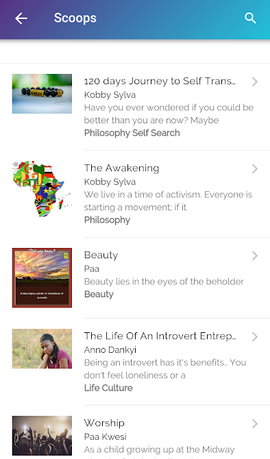

# TRIDENT - ONLINE READER AND LIBRARY
-  `#f03c15I did not know about Git and pushing code to remote repositories when I was doing this project a couple of years ago. This is to explain the few commits made. I just pushed the code recently for public viewing`

**Find that space where you can share your bright ideas and creativity with the world. Share your short stories, poems, puns, recipes, articles and research findings. Publish your books and magazines or buy your favourite books from our stores, which gives you multiple payment methods for easier and smoother transactions**

## Features
* Upload Books
* Search for Books
* Buy Books
* Sell Books
* Read Books


### USAGE (DISCONTINUED)
```
https://play.google.com/store/apps/details?id=com.fishpott.trident&hl=en_AU
```
## Screenshots
</br>
<div align="center">
   <table align="center" border="0" >
  <tr>
    <td>
      
    <td>
      
    </td>
    <td> 
     
    </td>
  </table>
  </div>
</br>
<div align="center">
  <table align="center" border="0" >
  <tr>
    <td> 
     
    </td>
    <td> 
     
    </td>
  </tr>
</table>
  </div>
## Authors

* **Dankyi Anno Kwaku** - *FishPot Company Limited*


